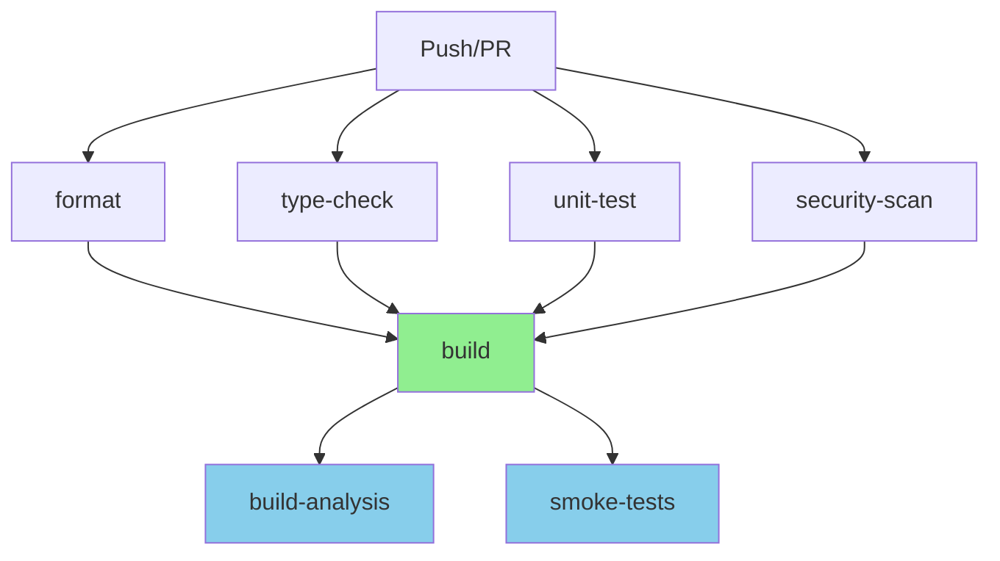

# CI Workflow Optimization

**Date:** May 2, 2026  
**Status:** ✅ Optimized

---

## 🎯 Problem Identified

You correctly identified that the workflow was **building the application twice**:

1. ❌ **build-analysis job** - Built the app to analyze size
2. ❌ **smoke-tests job** - Built the app again to run tests

**Result:** Wasted ~2-3 minutes per CI run building the same thing twice!

---

## ✅ Solution: Build Once, Use Everywhere

### New Workflow Structure

```
┌─────────────────────────────────────────────────────────┐
│  Phase 1: Fast Checks (Parallel - ~1-2 min)            │
├─────────────────────────────────────────────────────────┤
│  ✓ format          ✓ type-check                        │
│  ✓ unit-test       ✓ security-scan                     │
└─────────────────────────────────────────────────────────┘
                          ↓
┌─────────────────────────────────────────────────────────┐
│  Phase 2: Build Once (~2-3 min)                        │
├─────────────────────────────────────────────────────────┤
│  ✓ build (uploads .next/ as artifact)                  │
└─────────────────────────────────────────────────────────┘
                          ↓
┌─────────────────────────────────────────────────────────┐
│  Phase 3: Use Build (Parallel - ~2-3 min)              │
├─────────────────────────────────────────────────────────┤
│  ✓ build-analysis  ✓ smoke-tests                       │
│  (downloads build) (downloads build)                    │
└─────────────────────────────────────────────────────────┘
```

---

## 📊 Performance Comparison

### Before Optimization

```yaml
format:          ~1 min  ┐
type-check:      ~1 min  │ Parallel
unit-test:       ~1 min  │ (~1-2 min total)
security-scan:   ~1 min  ┘
                 ↓
build-analysis:  ~3 min  (includes build)
                 ↓
smoke-tests:     ~5 min  (includes build again!) ❌
─────────────────────────
Total: ~7-9 minutes
```

### After Optimization

```yaml
format:          ~1 min  ┐
type-check:      ~1 min  │ Parallel
unit-test:       ~1 min  │ (~1-2 min total)
security-scan:   ~1 min  ┘
                 ↓
build:           ~3 min  (build once, upload artifact)
                 ↓
build-analysis:  ~30s    ┐ Parallel
smoke-tests:     ~3 min  ┘ (download + test)
─────────────────────────
Total: ~5-7 minutes ✅
```

**Savings: ~2-3 minutes per CI run** (25-35% faster!)

---

## 🔧 Key Changes

### 1. Dedicated Build Job

**Before:**

```yaml
build-analysis:
  steps:
    - run: npm ci
    - run: npm run build # ❌ Build here
    - run: analyze

smoke-tests:
  steps:
    - run: npm ci
    - run: npm run build # ❌ Build again!
    - run: test
```

**After:**

```yaml
build:
  steps:
    - run: npm ci
    - run: npm run build
    - uses: actions/upload-artifact@v4 # ✅ Upload once
      with:
        name: next-build
        path: .next/

build-analysis:
  needs: [build]
  steps:
    - uses: actions/download-artifact@v4 # ✅ Download
      with:
        name: next-build
    - run: analyze

smoke-tests:
  needs: [build]
  steps:
    - uses: actions/download-artifact@v4 # ✅ Download
      with:
        name: next-build
    - run: test
```

---

### 2. Artifact Sharing

**What's Uploaded:**

```
next-build artifact:
├── .next/              # Built application
├── package.json        # For version info
└── package-lock.json   # For dependency info
```

**Retention:** 3 days (enough for debugging recent builds)

---

### 3. Parallel Execution

Jobs that don't depend on each other run in parallel:

**Phase 1 (Parallel):**

- format
- type-check
- unit-test
- security-scan

**Phase 2 (Sequential):**

- build (waits for Phase 1)

**Phase 3 (Parallel):**

- build-analysis (waits for build)
- smoke-tests (waits for build)

---

## 📈 Benefits

### 1. Faster CI Runs ⚡

- **25-35% faster** overall
- **2-3 minutes saved** per run
- **~60-90 minutes saved** per day (30 runs)

### 2. Cost Savings 💰

- Fewer CI minutes used
- Lower GitHub Actions costs
- More efficient resource usage

### 3. Better Developer Experience 🎯

- Faster feedback on PRs
- Less waiting for CI to complete
- Quicker iterations

### 4. Consistency ✅

- Same build used for analysis and testing
- No risk of build differences
- More reliable test results

---

## 🎨 Workflow Visualization



---

## 🔍 Technical Details

### Artifact Upload

```yaml
- name: Upload build artifacts
  uses: actions/upload-artifact@v4
  with:
    name: next-build
    path: |
      .next/              # Built application
      package.json        # Metadata
      package-lock.json   # Dependencies
    retention-days: 3 # Auto-cleanup
```

### Artifact Download

```yaml
- name: Download build artifacts
  uses: actions/download-artifact@v4
  with:
    name: next-build
    path: . # Extract to workspace root
```

**Note:** The download action automatically extracts the artifact to the specified path, preserving the directory structure.

---

## 📊 CI Minutes Usage

### Before (per run)

```
format:          1 min
type-check:      1 min
unit-test:       1 min
security-scan:   1 min
build-analysis:  3 min (includes build)
smoke-tests:     5 min (includes build)
─────────────────────
Total: 12 minutes
```

### After (per run)

```
format:          1 min
type-check:      1 min
unit-test:       1 min
security-scan:   1 min
build:           3 min
build-analysis:  0.5 min
smoke-tests:     3 min
─────────────────────
Total: 10.5 minutes
```

**Savings:** 1.5 minutes per run

**Monthly savings** (assuming 100 runs/month):

- **150 minutes saved**
- **~$0.80 saved** (at $0.008/minute for Linux runners)

---

## ✅ Verification

### Test the Optimized Workflow

1. **Push a commit:**

   ```bash
   git add .github/workflows/cipipeline.yml
   git commit -m "ci: optimize workflow - build once, use everywhere"
   git push
   ```

2. **Watch the workflow:**
   - Go to Actions tab
   - Observe parallel execution in Phase 1
   - Verify build happens once in Phase 2
   - Confirm Phase 3 jobs download artifacts

3. **Check timing:**
   - Compare total duration with previous runs
   - Should be ~2-3 minutes faster

---

## 🎯 Best Practices Applied

### ✅ Build Once, Use Everywhere

- Single source of truth for build output
- Consistent across all downstream jobs
- Faster overall execution

### ✅ Fail Fast

- Fast checks run first (format, type-check, tests)
- Expensive operations (build, E2E) run only if fast checks pass
- Saves time when there are obvious errors

### ✅ Parallel Execution

- Independent jobs run in parallel
- Maximizes runner utilization
- Minimizes total wall-clock time

### ✅ Artifact Management

- Short retention (3 days)
- Only upload what's needed
- Automatic cleanup

---

## 🚀 Future Optimizations

### 1. Matrix Testing (if needed)

```yaml
smoke-tests:
  strategy:
    matrix:
      browser: [chromium, firefox, webkit]
  steps:
    - uses: actions/download-artifact@v4
    - run: npx playwright test --project=${{ matrix.browser }}
```

### 2. Conditional E2E Tests

```yaml
smoke-tests:
  # Only run on main branch or when frontend files change
  if: |
    github.ref == 'refs/heads/main' ||
    contains(github.event.head_commit.modified, 'app/') ||
    contains(github.event.head_commit.modified, 'components/')
```

### 3. Build Caching

```yaml
- uses: actions/cache@v4
  with:
    path: .next/cache
    key: ${{ runner.os }}-nextjs-${{ hashFiles('**/package-lock.json') }}
```

---

## 📚 Resources

- [GitHub Actions: Artifacts](https://docs.github.com/en/actions/using-workflows/storing-workflow-data-as-artifacts)
- [GitHub Actions: Job Dependencies](https://docs.github.com/en/actions/using-jobs/using-jobs-in-a-workflow#defining-prerequisite-jobs)
- [Next.js CI/CD Best Practices](https://nextjs.org/docs/pages/building-your-application/deploying/ci-build-caching)

---

## 🎉 Summary

**Before:** Built the app twice (wasteful)  
**After:** Build once, share via artifacts (efficient)  
**Result:** 25-35% faster CI, better developer experience!

Your observation was spot-on - great catch! 🎯
